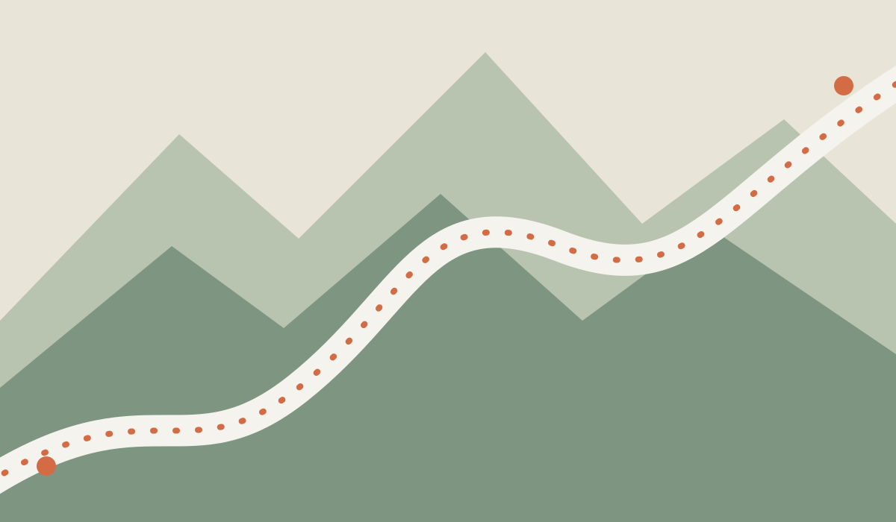

# Ride Nearby



*Ride Nearby — discover roads worth taking.*

A lightweight, mobile-first web app for discovering curated motorcycle loops near your current location in Spain. The interface is available in English and Spanish (English by default).

## What it does

- Asks for location only when you tap **Use my location**.
- Ranks hand-picked routes by distance to their starting point and filters by nearby radius, route distance, and estimated ride time.
- Opens the route stops in Google Maps for live directions.
- Includes an English/Spanish language switch and remembers the selected language on the device.
- Works as an installable PWA and caches its app shell for offline access.
- Sends the selected location to Supabase only to calculate nearby routes; it is not stored by the application. See [`privacy.html`](privacy.html).
- Includes a Supabase migration for a live route catalogue and a CAPTCHA-protected, moderation-first suggestion flow.

## Run locally

Geolocation works on HTTPS sites and on `localhost`. Python 3 is enough to serve the static files; no package install or API key is needed.

```sh
python3 -m http.server 8000
```

Then open <http://localhost:8000> on your computer or phone. To test from another device on your Wi-Fi, use an HTTPS tunnel or deploy the site; browsers normally block location access over plain HTTP on a network address.

## Supabase live catalogue

The app runs in demo mode until `supabase-config.js` contains the public Supabase URL, anonymous key, and Cloudflare Turnstile site key. The browser only receives published routes. Route suggestions are sent to a Supabase Edge Function, checked with Turnstile, and stored as `pending`; they are not publicly readable and must be reviewed before being copied into `motorcycle_routes`.

1. Create a Supabase project and enable the PostGIS extension if it is not already enabled.
2. Run `supabase/migrations/20261002000000_route_catalog.sql` in the Supabase SQL Editor.
3. Create a Cloudflare Turnstile widget for the deployed site.
4. Deploy `supabase/functions/submit-route/index.ts` with the Supabase CLI and set the server-side secrets:

   ```sh
   supabase secrets set TURNSTILE_SECRET=your_turnstile_secret TURNSTILE_HOSTNAME=your-domain.example RATE_LIMIT_SALT=a-long-random-secret
   ```

   `SUPABASE_URL` and `SUPABASE_SERVICE_ROLE_KEY` are supplied by Supabase Edge Functions. Set `TURNSTILE_HOSTNAME` to the exact public hostname (for example `www.example.com`) and use a fresh random `RATE_LIMIT_SALT`. Never place these secrets or the service-role key in the browser.

5. Copy the project URL, anon key, and Turnstile site key into `supabase-config.js`.
6. Review pending submissions in Supabase, translate/validate them, then insert approved routes into `motorcycle_routes`.

The complete approval and rejection procedure, including SQL templates, is documented in [`docs/route-moderation.md`](docs/route-moderation.md).

The Google Routes API `TWO_WHEELER` mode remains deliberately unused for Spain: Google’s current official coverage list does not include Spain, and Google requires a beta warning for displayed two-wheeler routes. Google Maps is still used as the hand-off for the final directions.

## Route data and sources

Route descriptions, route notes and illustrations in this repository are original. External links are provided for further reading and verification, not as copied content. Starting-point coordinates are used to sort nearby routes. Route distances and ride times are estimates; Google Maps calculates live directions from the listed stops. The app does not claim that Google Maps provides a motorcycle-specific routing mode.

The catalogue currently contains 20 published routes, including 7 in Catalonia. The original seed routes include:

- Sierra de Aracena, Guadarrama mountain passes, and Sierra de Grazalema — [Motociclismo: motorcycle routes in Spain's mountains](https://www.motociclismo.es/rutas/rutas-moto-sierra-espana_181789_102.html)
- Picos de Europa classic loop — [RACC: discover the Picos de Europa by motorcycle](https://www.racc.es/blog/moto/picos-de-europa-ruta-en-moto/)
- Montserrat backroads — [Motociclismo: motorcycle routes in Catalonia](https://www.motociclismo.es/rutas/rutas-moto-cataluna-nzm_247884_102.html)

The expanded catalogue also covers the Alpujarra, Cazorla, Cabo de Creus, Cabriel and Júcar, Rías Baixas, Rías Altas, Sierra de Gata, the Miño, Mallorca and Ribeira Sacra. The Catalonia additions cover inland Alt Empordà, La Garrotxa, Priorat/Montsant, Mont Caro and Vall d’Aran/Cerdanya. The expansions are reproducible from [`supabase/migrations/20261002010000_add_spain_route_catalog.sql`](supabase/migrations/20261002010000_add_spain_route_catalog.sql) and [`supabase/migrations/20261002020000_add_catalonia_routes.sql`](supabase/migrations/20261002020000_add_catalonia_routes.sql).

Always check current road conditions, access restrictions, weather, and fuel availability before riding. Route access can change seasonally.

## Deploy to GitHub Pages

The included GitHub Actions workflow deploys the repository root to GitHub Pages whenever changes are pushed to `main`. In the repository settings, set **Pages → Build and deployment → Source** to **GitHub Actions** if it is not selected automatically.

## Tech

Plain HTML, CSS, and JavaScript in the browser, with optional Supabase/PostGIS and Cloudflare Turnstile services. There is no tracking or frontend build step.
